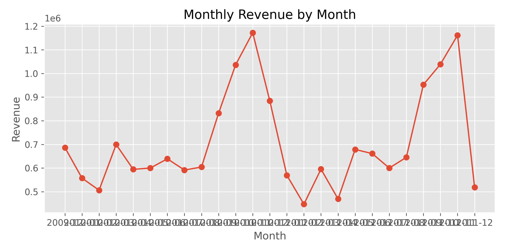

# 📊 Data Visualization with Matplotlib & Seaborn

This repository contains hands-on practice and implementations of **data visualization using Matplotlib and Seaborn** in Python.

The goal is to learn how to transform raw datasets into meaningful visual insights using widely used visualization libraries in data science.

---

## 📌 About This Repository

* 📈 Learning core data visualization concepts
* 📊 Implementing plots using Matplotlib and Seaborn
* 🧠 Understanding trends and patterns in datasets
* 💻 Practicing visualization using real-world data

---

## 📂 Repository Structure

```
Data-Visualization/
│
├── Data-Visualization.ipynb     # Notebook containing visualization practice
├── online_retail_II.xlsx        # Dataset used for analysis
├── Monthly_Revenue_plot.png     # Generated visualization output
├── LICENSE                      # MIT License
└── README.md                    # Project documentation
```

---

## 📊 Topics Covered

### Matplotlib

* Line plots
* Bar charts
* Histograms
* Scatter plots
* Plot customization (labels, titles, legends)

### Seaborn

* Statistical visualizations
* Distribution plots
* Count plots
* Heatmaps
* Advanced visual exploration

---

## 📁 Dataset Used

**Online Retail Dataset**

Used to explore:

* Monthly revenue trends
* Sales patterns
* Data distributions
* Basic exploratory data analysis

---

## 🛠️ Tech Stack

* Python
* Pandas
* Matplotlib
* Seaborn
* Jupyter Notebook

---

## 📈 Example Visualization

Example output generated from the dataset:



---

## 🚀 Why This Repository?

Data visualization is a critical skill in:

* Data Science
* Machine Learning
* Business Analytics
* Exploratory Data Analysis (EDA)

This repository documents practical experimentation with visualization tools to better understand data patterns.

---

## ⭐ Support

If you find this repository useful, consider giving it a ⭐.
